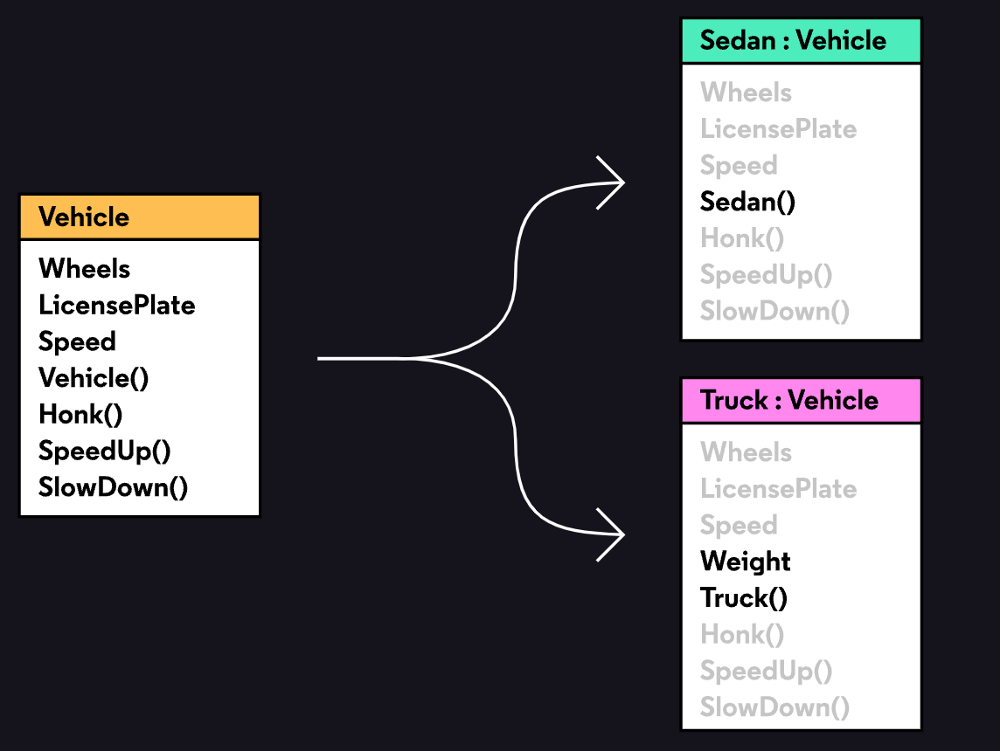

## Introduction to Interfaces

Interfaces, which are sets of actions and values that describe how a class can be used. This lets the computer check that we are using each type legally, thus preventing a whole group of type errors!

---
## Build an Interface

We will be designing a new set of transportation machines that satisfy the requirements of BOTH car designers and the highway patrol. First the highway patrol tells us: “Every automobile on the road must have these properties and methods accessible to us:”

- speed
- license plate number
- number of wheels
- ability to honk

The patrol needs this information to write speeding tickets and prevent bad behavior on the highway.

The patrol needs this information to write speeding tickets and prevent bad behavior on the highway.

In other words, the patrol makes these requirements so that it can interact with automobiles in a certain way. In C#, this group of interactions is called an `interface`. The `interface` is a set of properties, methods, and other members. They are declared with a signature but their behaviors are not defined. A class implements an `interface` if it defines those properties, methods, and other members.


or example, if the patrol requires automobiles to have a license plate, then the `IAutomobile interface` contains a LicensePlate property. A class implements this `interface` if it defines a `LicensePlate property`.

The skeleton of an interface looks a bit like a class:

```
interface IAutomobile
{
}
```

Every interface should have a name starting with `“I”`. This is a useful reminder to other developers and our future selves that this is an interface, not a class. We can add members, like properties and methods, to the interface. Here’s an example of a fake property and method:

An interface is a set of actions and values, but it doesn’t specify how they work.


```
interface IAutomobile
{
  string Id { get; }
  void Vroom();
}
```
---
## Implementing an Interface

As we design our automobile-like classes, we’ll need to implement this `IAutomobile` interface. In C#, we must first clearly announce that a class implements an interface using the colon syntax:

```
class Sedan : IAutomobile
{
}
```

This empty Sedan class “promises” to implement the `IAutomobile interface`. In other words, it must have the properties and methods the highway patrol asked for (Speed, LicensePlate, Wheels, and Honk()).If we don’t, we get a type error. Remember that these members must be `public`

```
class Sedan : IAutomobile
{
  public string LicensePlate
  { get; }
 
  // and so on...
}

```
---
## What Interfaces Cannot Do
In fact, `interfaces` cannot specify two types of members that are commonly found in classes:

- Constructors
- Fields

---
## Implementing an Interface Again

 There can be multiple classes that implement an interface.Even though `Sedan` and` Truck` are different types, we can assume that they behave similarly because they share an interface.

 ---
 ## Finish Truck Class
The car designers have asked that trucks act a bit differently from sedans. `Trucks` need a new property called `Weight`. Whenever a truck is constructed, its number of wheels will depend on its weight. For example, a heavier truck might need 12 instead of 8 wheels to support itself.

Just like sedans, trucks will also `SpeedUp()` and `SlowDown()`.

```
using System;

namespace LearnInterfaces
{
    class Truck : IAutomobile
    {
        //constructor
        public Truck(double speed, double weight)
        {
            this.Speed = speed;
            this.Weight = weight;
            LicensePlate = Tools.GenerateLicensePlate();
            if (weight < 400)
            {
                this.Wheels = 8;
            }
            else
            {
                this.Wheels = 12;
            }
        }

        //implement the interface
        public string LicensePlate { get; }

        public double Speed { get; set; }

        public int Wheels { get; }

        public double Weight { get; }

        //methods
        public void Honk()
        {
            Console.WriteLine("HONK!");
        }

        public void SpeedUp()
        {
            Speed += 5; //need set() interfeace
        }

        public void SlowDown()
        {
            Speed -= 5;
        }
    }
}

```

---
## Testing Interfaces

Now we have a `Sedan` class and `Truck` class that implement the IAutomobile interface. Though they have some different behaviors, they both have the properties and method defined in the interface:

- double Speed
- string LicensePlate
- int Wheels
- void Honk()

At this point we can be confident that we won’t cause any errors if we try to access these members in either the `Sedan` or `Truck` class.

---
## Review
- Learned that interfaces are useful to guarantee certain functionality across multiple classes
- Built an interface using the `interface` keyword
- Defined properties and methods (but not constructors or fields) in the interface
- Built classes that implemented the interface
- Added members to the classes that weren’t specified in the interface


As a last note: a class can **implement multiple interfaces**. For example, `Sedan` could implement `IAutomobile` and a new `IRecyclable` interface. It would be useful to separate interfaces if they aren’t related, i.e. not all automobiles are recyclable.

We have duplicated code, like `SpeedUp()` and `SlowDown()`, in two classes, and we know that duplicated code is hard to maintain. Is there a way to avoid duplication?

**The answer has to do with inheritance**. The concept won’t be covered in this lesson, but now you have one good reason to learn it.

---
## Introduction to Inheritance
Duplicated code leads to errors. Say you have two classes` Sedan` and `Truck`. They’re different types, but they share a few properties and methods, like `SpeedUp()` and `SlowDown()`. If one of those members (say it’s `SpeedUp()`) has to change, then we would have to change the code in every location where `SpeedUp()` is defined.

In this case it’s two classes, but in other programs it may be many more! There are two reasons we don’t want to make the same change on code across multiple files:It’s a waste of time and More importantly, it is a big risk for making mistakes.

In this lesson you’ll learn about a solution to this problem: inheritance. With inheritance, you can define one superclass that contains the shared members (like `SpeedUp()` and `SlowDown()`). All classes that need those members can inherit them from the superclass.
---
## Superclass and Subclass

In inheritance, one class inherits the members of another class. The class that inherits is called a **subclass** or **derived class**. The other class is called a **superclass** or **base class**.

In our car example, Sedan and Truck are subclasses (or derived classes). They will inherit members from a new class called Vehicle, which is the superclass (or base class).

Before using inheritance, both classes had:

`Wheels`, `LicensePlate`, and `Speed `properties
`Honk()`, `SpeedUp()`, and `SlowDown()` methods
Similar constructors

We can pull these out of both classes and put it in a `Vehicle` class. `Sedan` and `Truck` will still have access to those members, but we only need to write them in one place.

By the way, this inheritance hierarchy can extend either way: a new `PickupTruck` class could inherit from `Truck`, which inherits from Vehicle, which inherits from a new Machine class. The only rule is that a class can only inherit from one base class, e.g. Vehicle can’t inherit from Machine and Contraption.




- `Sedan` and `Truck` inherit from Vehicle


- Members in black font are defined in that class


- Members in grey font have been inherited from a superclass

For example, `Wheels` is defined in the `Vehicle` class and inherited by `Sedan` and `Truck`. `Truck()` is defined only in the `Truck` class.

---
## Create a Superclass
A superclass is defined just like any other class:

```
class Vehicle
{
}

```
And a subclass inherits, or “extends”, a superclass using colon syntax (:):

```
class Sedan : Vehicle
{
}
```


A class can extend a superclass and implement an interface with the same syntax. Separate them with commas and make sure the superclass comes before any interfaces:

```
class Sedan : Vehicle, IAutomobile
{
}
```

The above code means that `Sedan` will inherit all the functionality of the `Vehicle` class, and it “promises” to implement all the functionality in the `IAutomobile` interface.
---
 ## Access Inherited Members with Protected
 A protected member can be accessed by the current class and any class that inherits from it. In this case, if the setter for `Vehicle.Wheels` is protected, then any `Vehicle`, `Truck`, and `Sedan` instance can call it.

---
## Access Inherited Members with Base

To construct a `Sedan`, we must first construct an instance of its superclass `Vehicle`.

We can refer to a superclass inside a subclass with the `base` keyword.

For example, in `Sedan`:`base.SpeedUp();` refers to the `SpeedUp()` method in `Vehicle.`

There’s special syntax for calling the superclass constructor:

```
class Sedan : Vehicle
{
  public Sedan (double speed) : base(speed)
  {
  }
}
```


The above code shows a `Sedan` that inherits from `Vehicle`. The `Sedan` constructor calls the `Vehicle `constructor with one argument, speed. This works as long as `Vehicle` has a constructor with one argument of type `double`.

Even if we don’t use `base()` in Sedan, it will call a Vehicle constructor. Without an explicit call to `base()`, any subclass constructor will implicitly call the default parameterless constructor for its superclass. For example, this code implicitly calls `Vehicle()`:

```
class Sedan : Vehicle
{
  // Implicitly calls base(), aka Vehicle()
  public Sedan (double speed)
  {
  }
}
```
---
## [Override Inherited Members](https://docs.microsoft.com/en-us/dotnet/csharp/programming-guide/classes-and-structs/knowing-when-to-use-override-and-new-keywords)

Say that we wanted to make one more vehicle that operates a bit differently than a sedan or truck. We want to use most of the members in Vehicle, but we need to write new versions of `SpeedUp()` and `SlowDown()`.


What we want is to override an inherited method. To do that, we use the `override` and `virtual` modifiers.

In the superclass, we mark the method in question as `virtual`, which tells the computer “this member might be overridden in subclasses”:
`public virtual void SpeedUp()`

In the subclass, we mark the method as `override`, which tells the computer “I know this member is defined in the superclass, but I’d like to `override` it with this method”:
`public override void SpeedUp()`

As an aside: there’s another way to solve this problem. Instead of using `virtual` and `override` to override a member, we can define a `new` member with the same name. Essentially, the inherited member still exists, but it is “hidden” by the member in the subclass. If this sounds confusing, that’s okay! We also think it leads to unnecessary confusion, and that leads to errors. We’re going to stick with the `virtual` - `override` approach in this lesson.

---

## Make Inherited Members Abstract
`Abstract` member have no implementation in the superclass, but they must be implemented in all subclasses.If one member of a class is `abstract`, then the class itself can’t really exist as an instance, and class must be abstract. Label it with abstract as well:`abstract class Vehicle`

To do this we need one more modifier: abstract. This line would go into the Vehicle class:

`public abstract string Describe();`

Once we write the abstract method and mark the class as abstract, we’ll need to actually implement it in each subclass. For example in `Sedan`:


```
public override string Describe()
{
  return $"This Sedan is moving on {Wheels} wheels at {Speed} km/h, with license plate {LicensePlate}.";
}
```
To make it clear that this `Describe()` method in `Sedan` is overriding the `Describe()` method in` Vehicle`, we will need to label it `override`.

---

## Review

- Inheritance is a way to avoid duplication across multiple classes.

- In inheritance, one class inherits the members of another class.

- The class that inherits is called a subclass or derived class. The other class is called a superclass or base class.

- We can access a superclass’ members using `base`. This is very useful when calling the superclass’ constructor.

- We can restrict access to a superclass and its subclasses using `protected`.

- We can `override` a superclass member using `virtual` and `override`.

- We can make a member in a superclass without defining its implementation using `abstract`. This is useful if every subclass’ implementation will be different.
